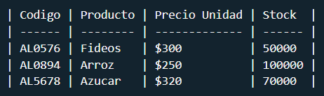

# Conceptos Fundamentales de Markdown

## Indice

1. [Textos](#tipos-de-texto)
2. [Encabezados](#encabezados)
3. [Enlaces](#enlaces)
4. [Division de Seccion](#division-de-seccion)
5. [Listas](#tipos-de-listas)
6. [Citas](#citas)
7. [Tablas](#tablas)
8. [Codigos](#codigos)
9. [Escape de caracteres especiales](#escape-de-caracteres)
10. [Emojis](#emojis)
11. [Codigo HTML](#codigo-html)

---

## Tipos de Texto

| Tipo    | Sintaxis          | Ejemplo                          |
| ------- | ----------------- | -------------------------------- |
| Cursiva | \_texto\_         | _Texto en cursiva_               |
| Negrita | \*\*texto\*\*     | **Texto en negrita**             |
| Mixto   | \*\*\_texto\_\*\* | **_Texto en cursiva y negrita_** |

[🔼](#indice)

---

## Encabezados

| Tipo de Encabezado | Sintaxis                  | Equivalencia en HTML |
| ------------------ | ------------------------- | -------------------- |
| Encabezado 1       | \# Encabezado 1           | \<h1\>               |
| Encabezado 2       | \#\# Encabezado 2         | \<h2\>               |
| Encabezado 3       | \#\#\# Encabezado 3       | \<h3\>               |
| Encabezado 4       | \#\#\#\# Encabezado 4     | \<h4\>               |
| Encabezado 5       | \#\#\#\#\# Encabezado 5   | \<h5\>               |
| Encabezado 6       | \#\#\#\#\#\# Encabezado 6 | \<h6\>               |

[🔼](#indice)

---

## Enlaces

| Tipos de Enlaces | Sintaxis                            | Ejemplo                                                                 |
| ---------------- | ----------------------------------- | ----------------------------------------------------------------------- |
| Enlace Externo   | \[texto de enlace\]\(enlace\)       | [Github](https://www.github.com)                                        |
| Enlace Interno   | \[texto de enlace\]\(\#encabezado\) | [Tipos de texto](#tipos-de-texto)                                       |
| Imagen           | \!\[descripcion\]\(enlace\)         |  |

[🔼](#indice)

---

## Division de Seccion

| Sintaxis | Equivalencia en HTML |
| -------- | -------------------- |
| \-\-\-   | \<hr\>               |

[🔼](#indice)

---

## Tipos de Listas

| Tipo de Lista   | Sintaxis |
| --------------- | -------- |
| Lista Enumerada | N. texto |
| Lista de Items  | \- texto |
| Lista Anidada   | \* texto |

## Ejemplos

### Lista Enumerada

1. Python
2. Java
3. JavaScript

### Lista de Items

- Celulares
- PC de Escritorio
- Notebooks

### Listas Anidadas

- Computadora
  - Procesador
    - Intel
      - !3
      - !5
      - !7
      - !9
    - AMD
      - Ryzen 3
      - Ryzen 5
      - Ryzen 7
      - Ryzen 9
  - Mother Board
  - Fuente de Alimentacion
    - Modular
    - No modular
    - Generica

[🔼](#indice)

---

### Citas

- De 1 sola linea

  - Sintaxis
    - \> texto citado
  - Ejemplo
    > texto citado

- De varias lineas
  - Sintaxis
    - \> texto citado
    - \>
    - \> autor
  - Ejemplo
    > Texto citado
    >
    > Autor

[🔼](#indice)

---

## Tablas

#### Sintaxis



#### Ejemplo

| Codigo | Producto | Precio Unidad | Stock  |
| ------ | -------- | ------------- | ------ |
| AL0576 | Fideos   | $300          | 50000  |
| AL0894 | Arroz    | $250          | 100000 |
| AL5678 | Azucar   | $320          | 70000  |

[🔼](#indice)

---

## Codigos

#### Palabra o Parrafo

- Sintaxis:
  - \`codigo\`
- Ejemplo
  - `let`, `var`, `const`

#### Bloque de Codigo

- Sintaxis

  - \`\`\` **lenguaje**
    bloque de codigo
    \`\`\`

- Ejemplos

``` py
def hello(name) :
    return f"Hello {name}"
```

``` js
const add = (a, b) => {
  return a + b;
};
```
[🔼](#indice)

---

## Escape de Caracteres

| Sintaxis           | Ejemplo |
| ------------------ | ------- |
| \\caracterEspecial | \\      |

[🔼](#indice)

---

## Emojis
😄 😄 😄 😄 😄 😄 😄 😄 😄 😄 😄 😄 😄 😄 😄 😄 😄 😄 😄 😄 
#### Fuentes
[Pagina de emojis](https://tutorialmarkdown.com/emojis)

[🔼](#indice)

---

## Codigo HTML
Markdown al ser un lenguaje de marcado admite codigo HTML

<form>
    <label for="search">Buscar</label>
    <input name="search" id="search"></input>
</form>

[🔼](#indice)